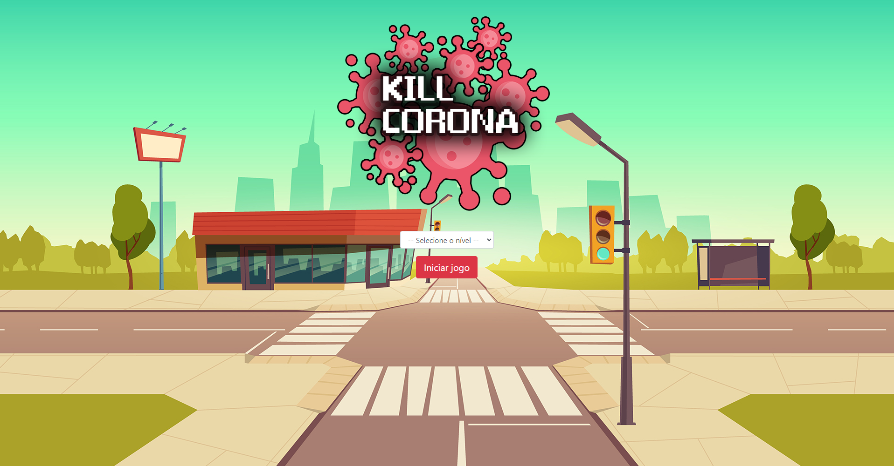
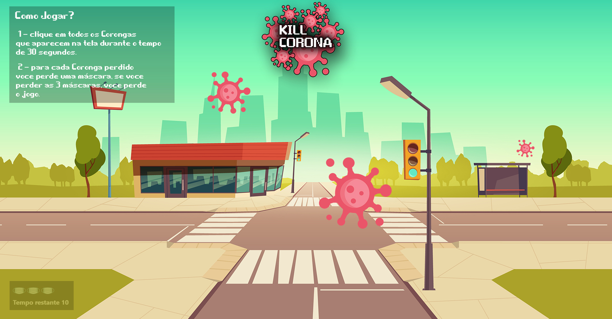

# App Game - Kill Corona
>Este projeto é um App Game desenvolvido p/ fins educacionais com o intuito de testar os conceitos de JavaScript aprendidos em aula.

O objetivo no App Game ***Kill Corona*** é matar todos os vírus que aparecem na tela clicando em cima deles no tempo cronometrado de 30 segundos, pra cada vírus perdido, o jogador perde uma vida (representada pelo símbolo de máscara), ao fim das 3 vidas, o jogador perde a partida, mas caso consiga chegar ao fim do tempo cronometrado de 30 segundos, o jogador vence o jogo.

## Tela inicial

Na tela inicial o jogador pode escolher o nível de dificuldade do jogo, sendo eles: ***Normal, Dificíl e Chuck Norris***.

## Tela de jogo

Na tela de jogo, o jogador deve clicar em todos os "coronas" que aparecerem na tela, com o álcool gel (cursor do mouse) no durante o tempo de 30 segundos.

